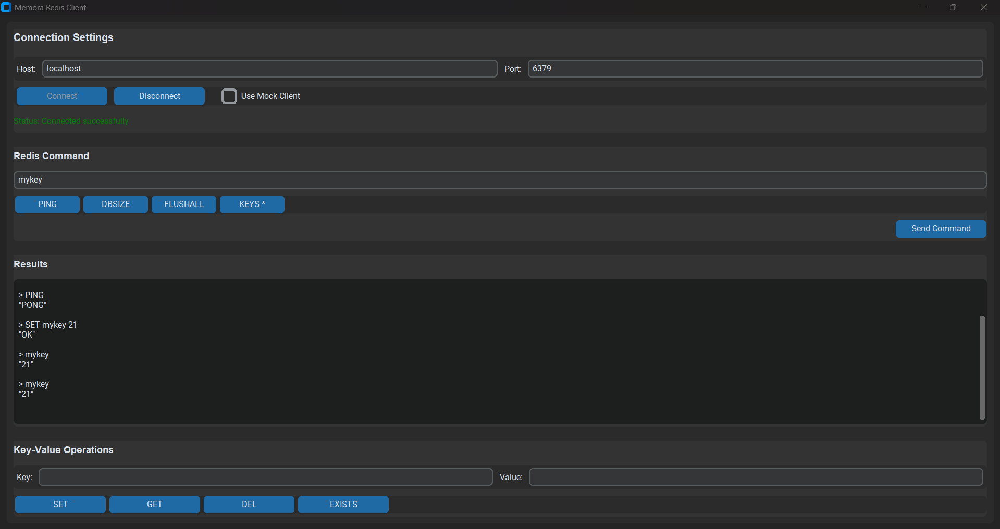

# Memora 🗄️

A Redis-like in-memory key-value database built from scratch in Go, designed to solve some Redis pain points while maintaining compatibility.


## Demo on Youtube
[](https://www.youtube.com/watch?v=u44VhUXWn7o)

## 🌟 Features

### Core Features
- **Full RESP Protocol Support** - Compatible with Redis clients
- **Custom Hash Table** - Built from scratch without STL maps
- **Goroutine-based Concurrency** - High-performance event loop
- **Multiple Data Types** - Strings, Lists, Sets, Hashes
- **TTL Support** - Automatic key expiration with background cleanup
- **Persistence** - RDB-like snapshotting with background saves

### Enhanced Features
- **Natural Language Sorting** - Improved `ZRANGEBYLEX` with better sorting
- **Case-Insensitive Commands** - Commands work in any case
- **Direct Key Access** - Type just the key name to GET values
- **Better Error Messages** - Redis-compatible error responses

## 🚀 Quick Start

### Installation

```bash
git clone https://github.com/Jishnu-Prasad888/Memora
cd memora
go build
```

### Running the Server

```bash
# Start the server
go run main.go -mode server -host localhost -port 6379

# Or use the binary
./memora -mode server
```
### Using the GUI Client



```cmd
pip install customtkinter
# go into the GUI client folder
python gui.py
```

### Using the CLI Client

```bash
# Interactive CLI client
go run main.go -mode client

# Or connect with Redis CLI
redis-cli -h localhost -p 6379
```

## 📚 Supported Commands

### String Operations
- `SET key value [EX seconds]` - Set key with optional expiration
- `GET key` - Get key value
- `INCR key` - Increment integer value
- `DECR key` - Decrement integer value

### List Operations
- `LPUSH key value [value...]` - Push to list head
- `RPUSH key value [value...]` - Push to list tail
- `LPOP key` - Pop from list head
- `RPOP key` - Pop from list tail
- `LLEN key` - Get list length

### Set Operations
- `SADD key member [member...]` - Add members to set
- `SREM key member [member...]` - Remove members from set
- `SMEMBERS key` - Get all set members
- `SISMEMBER key member` - Check set membership

### Hash Operations
- `HSET key field value [field value...]` - Set hash fields
- `HGET key field` - Get hash field value
- `HDEL key field [field...]` - Delete hash fields
- `HGETALL key` - Get all hash fields and values
- `HKEYS key` - Get all hash field names
- `HVALS key` - Get all hash values

### Key Operations
- `DEL key [key...]` - Delete keys
- `EXISTS key [key...]` - Check key existence
- `KEYS pattern` - Find keys by pattern
- `EXPIRE key seconds` - Set key expiration
- `TTL key` - Get time to live

### Server Operations
- `PING` - Test connection
- `ECHO message` - Echo message
- `FLUSHALL` - Delete all keys
- `DBSIZE` - Get key count

## 🛠️ Advanced Usage

### TTL and Expiration
```bash
# Set key with 60 second expiration
> SET session:user123 "data" EX 60
"OK"

# Set expiration on existing key
> EXPIRE mykey 3600
(integer) 1

# Check remaining time
> TTL session:user123
(integer) 55
```

### Pattern Matching
```bash
# Find all user keys
> KEYS user:*
1) "user:1"
2) "user:2"
3) "user:3"

# Find all keys
> KEYS *
1) "user:1"
2) "session:abc"
3) "config:app"
```

### Data Type Examples
```bash
# Strings
> SET username "john_doe"
> GET username

# Lists  
> LPUSH tasks "task1" "task2"
> LPOP tasks

# Sets
> SADD tags "redis" "database" "go"
> SMEMBERS tags

# Hashes
> HSET user:1000 name "John" age "30"
> HGETALL user:1000
```

## 🔧 Configuration

### Command Line Options
```bash
-mode string    Mode: server or client (default "server")
-host string    Server host (default "localhost") 
-port string    Server port (default "6379")
```

### Environment Variables
```bash
export MEMORA_HOST="0.0.0.0"
export MEMORA_PORT="6380"
```

## 🏗️ Architecture

```
Memora/
├── server/           # TCP server and protocol handling
│   ├── server.go     # Main server implementation
│   ├── protocol.go   # RESP protocol parser
│   └── client.go     # Client connection management
├── store/            # Data storage engine
│   ├── store.go      # Data store interface
│   ├── hashtable.go  # Custom hash table implementation
│   └── persistence.go # Snapshot persistence
├── commands/         # Command handlers
│   └── commands.go   # All command implementations
└── client/           # Client implementation
    └── client.go     # CLI client
```

### Key Components

- **Custom Hash Table**: Optimized for in-memory operations
- **RESP Protocol**: Full Redis protocol compatibility
- **Event Loop**: Goroutine-based concurrency model
- **Background Cleanup**: Automatic TTL expiration
- **Snapshot Persistence**: Periodic background saves

## 🧪 Testing

```bash
# Run tests
go test ./...

# Test with Redis compatibility
redis-cli -h localhost -p 6379 PING

# Benchmark performance
go test -bench=. ./store
```

## 📊 Performance
- **Memory**: Efficient custom hash table implementation
- **Concurrency**: Goroutine-based non-blocking I/O

